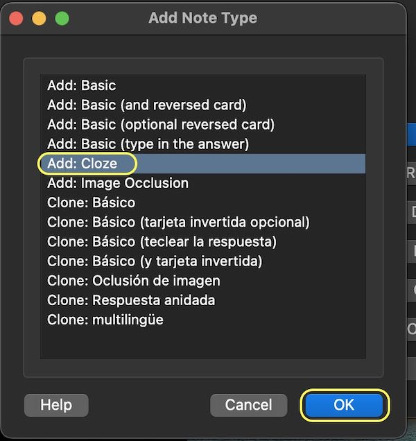
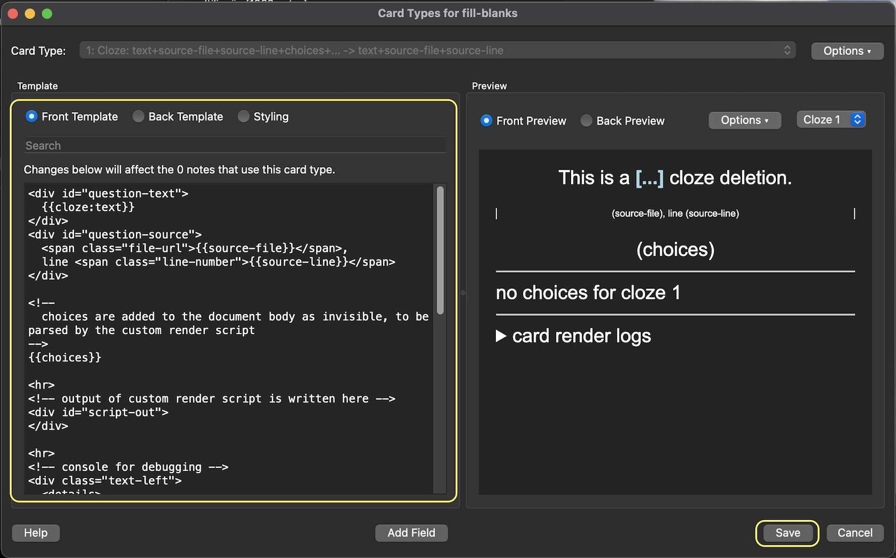

# Quiz Card Generator

Given a source document, generate quiz/flash cards. It is currently tailored specifically for **language learning**, so best candidate material to use as input would be stuff like the following, in the target language:

- Movie scripts
- Subtitle files
- Book chapters
- News and journal articles

[quizgen\_webui\_demo\_2024-02-11.fps-15](https://github.com/ogallagher/quizcard-generator/assets/17031438/dd0d440a-a198-428e-96ed-6a5f92b3ec1c)

## Installation

Available as a package via [npm](https://npmjs.org).

```shell
npm install --global --omit dev quizcard-generator
# quizcard-generator should now be available in user executable path
quizcard-generator --help
```

### Download

An alternative is to download and build the source.

```shell
# download source repo
git clone https://github.com/ogallagher/quizcard-generator

# install dependencies
npm install
# Note there are also several optional dependencies including yargs, 
# which is required to run the generator as a standalone/entrypoint program.
npm install yargs
```

### Compile TypeScript and quiz card templates

The source is provided as typescript files, which must be compiled to javascript before execution.

```shell
# typescript should already be installed from previous step
# npm install typescript

npm run build
```

## Usage

Below instructions assume you're using the CLI tool, but as shown in the demo video above, there is also a hosted web UI at [wordsearch.dreamhosters.com/quizcard-generator](https://wordsearch.dreamhosters.com/quizcard-generator), which provides an interface ontop of the CLI script.

For all available options, see `node quizcard_generator.js --help` (or `quizcard-generator --help` if you followed the instructions for global install from NPM above).

### Source document

Find/generate and download a **source document**. Only `utf-8` encoded plain text is currently supported. There are a few examples provided at `docs/examples/<lang>_source.txt`.

The path to the document will be provided with `--input-file`.

### Excludes

If you know of any words that should not be included as testable vocabulary, you can specify them individually using the `--exclude-word` cli option, but it's more convenient to specify them in one or more exlude files, passing each excludes file path to `--excludes-file`.

> Example excludes file

```txt
# comments have '#' at beginning of the line
each
word
or
/reg(ular)?exp(ression)?/
# is on its own line
```

### Run Quiz Card Generator from CLI

The `quizcard_generator.js` can be both imported or run as an entrypoint script. 

In the latter case, most of the execution will be routed to `quizcard_cli.js`, but this second file is not actually a wrapper; it's an optional dependency used for cli execution. Admittedly, this can be a confusing control flow.

> Sample quiz card generator cli run

```shell
# build not necessary unless source files are changed or not yet compiled
npm run build

# execute quiz card generator
node quizcard_generator.js \
# with example korean exluded words file
--excludes-file "docs/examples/kor_source_excludes.txt" \
--input-file "docs/examples/kor_source.txt" \
# used to name the output file
--anki-notes-name kor-example-1 \
--log-level info
```

The single currently supported output file will be located at:

```txt
out/anki/notes/fill-blanks/<anki-notes-name>.txt
```

### Integrations - Anki

Generated quiz card information should be imported into [Anki](https://ankiweb.net) to be used. 

The output file from running the quiz card generator is an [Anki notes file](https://docs.ankiweb.net/importing/text-files.html), which will require a couple preparation steps within Anki to be usable on import.

#### 1. Create note type `fill-blanks` from base type `Cloze`




The note type name `fill-blanks` is to what the notes can be automatically assigned on import, which maps the file columns to field names.

#### 2. Define fields belonging to `fill-blanks` note type


The order of these fields must match the column **order** in the notes file generated by `quizcard-generator`:

- euid
- notetype _(meta field, omit)_
- tags _(meta field, omit)_
- text
- choices
- source-file
- source-line
- translations
- prologue
- epilogue

The **names** are also important, as they are referenced inside the card templates used to generate the quiz/flash cards from the notes. The options for each field mostly do not matter and are related to display within the Anki browser/navigator.


#### 3. Define card templates belonging to `fill-blanks` note type


As mentioned before, the card templates are quiz cards are generated from these notes. The files in `anki/card_templates/fill-blanks/` can be pasted into the 3 corresponding text inputs for defining the card templates.

- `front.html` &rarr; **Front template**
- `back.html` &rarr; **Back template**
- `style.css` &rarr; **Styling**



#### 4. Import notes file to Anki

Finally, return to the Anki main window and press **Import File** to select the file generated by `quizcard-generator` (in the above example, `out/anki/notes/fill-blanks/kor-example-1.txt`). The default settings should not need to be modified.


After importing, find the imported notes in the Anki browser to confirm the fields were correctly imported. Then, check out some card previews!


If you want to make bulk adjustments to these notes at the notes file generation step, you can generate a new/replacement notes file to `out/anki/notes/fill-blanks/`, which will have the updated notes. When the updated notes are imported into Anki, they are uniquely identified with the `euid` column, which will not change as long as the `quizcard-generator` input/source file name and line number to which the note belongs don't change. Notes already within Anki according to `euid` will then be updated instead of creating duplicates.

#### Render control tags

Tags are an organizational concept already present in Anki, and the quiz card generator (quizgen) includes them in its notes export in order to later quickly isolate notes within Anki that came from quizgen, and among them from what source texts they are. However, in addition to organizational tags, quizgen also uses card render control tags.

Render control tags serve as dynamic options to change how a note's cards are rendered.
Below is a list of supported render control tags. They are all included by default in the exported notes, unless otherwise specified. See [`anki/anki_tag.ts:RenderControlTag`](https://github.com/ogallagher/quizcard-generator/blob/main/anki/anki_tag.ts) jsdoc comments for latest details.

- `qg-show-logging` Render log messages in a text area near the bottom of the card. **Not included** by default. If you want to see log messages, you can specify this tag in the program options, or add the tag within Anki after import.
- `qg-show-choices` Show the multiple choices for the tested word.
- `qg-show-source-file` Show the note's source file.
- `qg-show-source-line` Show the note's line number in its source file.
- `qg-show-randomized` Shuffle choices randomly on render.
- `qg-show-prologue` Show preceding text from the source file.
- `qg-show-epilogue` Show following text from the source file.
